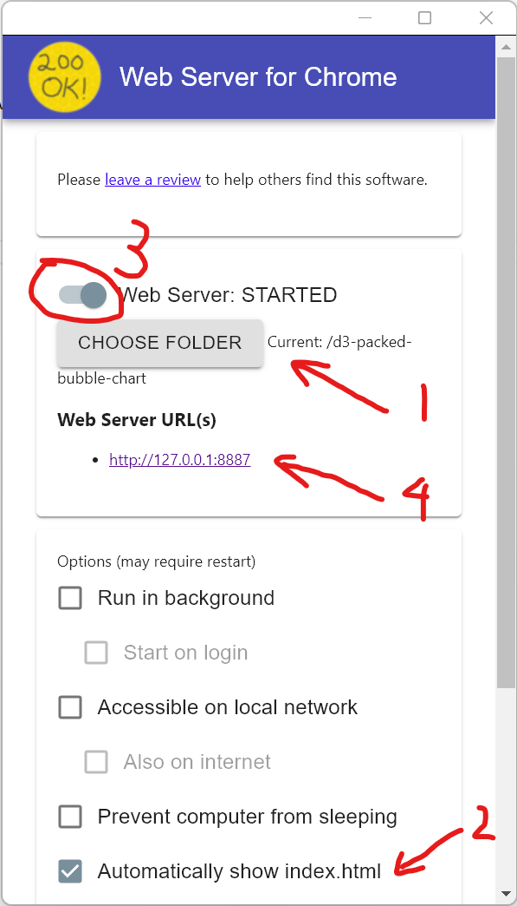

# 6893-project
## Packed-bubble chart:
Options:
* Number of bubbles
* Order: According to weight(Personalized), According to volume, Random
* Background color
* Personalization level (beta): None(0), Very weak(0.2), Weak(0.4), Strong(0.6), Very Strong(0.8)

Clicking on bubble will redirect to corresponding Twitter search page.

Set Up:
1. Install "Web Server for Chrome" extension and click "Lauch"

2. Choose the project folder, check "Automatically show index.html. Open the website by clicking the URL.
